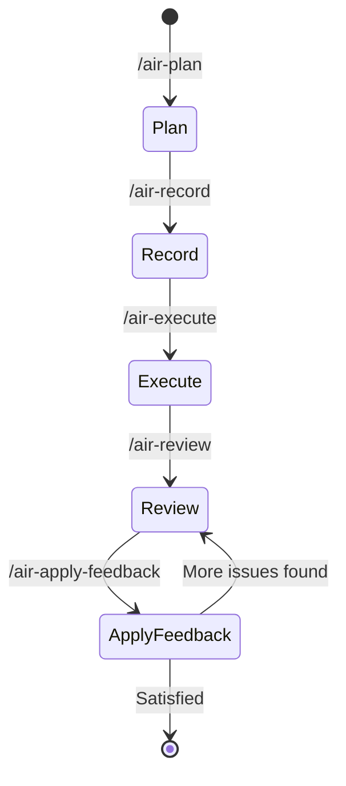

# Aircana

[](https://github.com/westonkd/aircana/actions/workflows/main.yml)
[](https://badge.fury.io/rb/aircana)

## Intro

Aircana aims to be a "batteries-included" CLI for common needs of Instructure Engineering teams using agents in development. It provides:

Consistent artifact generation and updating of agent, slash command, and hook ERB templates.

Subagent generation for improved context window management.

Agent-accessible knowledge bases sourced from Confluence or public websites, backed by manifest files.

Complete development workflow with five phases: plan, record, execute, review, and apply-feedback.

SQS integration for features like Slack notifications and messages.

While Aircana includes features beneficial in many agentic contexts (like knowledge base syncing), its primary tools are built on "human-in-the-loop" principles.

## How can I try it?

### Installation

Install the gem:

```bash
gem install aircana
```

Verify installation and dependency setup:

```bash
aircana doctor
```

Install Aircana files into your repo:

```bash
cd ~/my/repo
aircana install # This is a no-op if the repo already uses .aircana
```

### Take it for a spin

If your project previously had Aircana agents set up, run the following to populate each defined agent's knowledge base:

```bash
aircana agents refresh-all
```

To start using your agents with domain-specific knowledge, follow the agent workflow tutorial.

### Things to try

- Configure the Confluence integration and create your own domain-specific subagent

- Launch Claude Code and view the hooks installed by Aircana (prefixed with air). The /air-ask-expert command is pretty handy once you set up some agents with knowledbases.

- Set up the SQS integration to receive Slack messages when Claude Code needs your attention (documentation coming soon).

- Explore other tools by running `aircana --help`

## Development Workflow

Aircana provides a complete development lifecycle through five integrated slash commands:



### Quick Overview

1. **`/air-plan`** - Create strategic implementation plan
2. **`/air-record`** - Save plan to Jira ticket
3. **`/air-execute`** - Implement plan and create commit
4. **`/air-review`** - Adversarial code review with expert feedback
5. **`/air-apply-feedback`** - Apply review changes and amend commit

### Command Details

#### 1. `/air-plan` - Strategic Planning

Creates a high-level implementation plan by:
- Asking you to specify relevant files and directories
- Consulting specialized sub-agents for domain expertise
- Sharing research context to avoid duplicate work
- Generating a focused strategic plan (what to do, not how)
- Creating actionable todo checklist

The planner focuses on architecture decisions and approach, avoiding exhaustive code implementations.

#### 2. `/air-record` - Save to Jira

Records your approved plan to a Jira ticket by:
- Taking the ticket key/ID as input
- Delegating to the `jira` sub-agent for MCP operations
- Storing the plan in the ticket description or comments

This creates a traceable link between planning and execution.

#### 3. `/air-execute` - Implementation

Executes the strategic plan by:
- Reading the plan from the Jira ticket
- Creating detailed implementation todo list
- Presenting plan for your approval
- Implementing changes sequentially
- Writing unit tests (delegates to test-writing sub-agent if available)
- Running tests to verify implementation
- Creating git commit (delegates to git-ops sub-agent if available)

After commit creation, suggests running `/air-review`.

#### 4. `/air-review` - Adversarial Review

Conducts comprehensive code review of HEAD commit by:
- Analyzing changed files to identify technical domains
- Using sub-agent-coordinator to select relevant expert agents
- Presenting changes to experts in parallel
- Synthesizing feedback organized by severity (Critical/Important/Suggestions)
- Storing review output for next step

Explicitly states "Reviewing: <commit message>" and ends with "Run /air-apply-feedback".

#### 5. `/air-apply-feedback` - Apply Changes

Applies code review feedback by:
- Reading review output from conversation context
- Creating prioritized change plan (critical issues first)
- Presenting plan for your approval
- Applying approved changes
- Re-running unit tests
- Fixing any test failures
- **Amending HEAD commit** with improvements using `git commit --amend --no-edit`

This preserves the original commit message while incorporating review improvements in a single commit.

### Usage Example

```bash
# 1. Start planning
/air-plan
> Specify relevant files: src/api/, spec/api/

# 2. Save plan to ticket
/air-record PROJ-123

# 3. Execute implementation
/air-execute PROJ-123

# 4. Review the commit
/air-review

# 5. Apply feedback
/air-apply-feedback
```

## Key Concepts

### Subagents

Subagents are domain-specific agents to whom the primary Claude Code agent can delegate tasks and questions.

Each subagent has its own context window. Effectively using subagents can keep the main context window and per-agent context windows smaller for longer, leading to much more usable results and reducing the need to remind agents of core principles and tasks.

Claude Code can also run subagents in parallel. A "swarm" of appropriately designed subagents can expedite planning and execution tasks while considering a broader context.

Aircana allows easy generation of subagents and binds each to an agent-specific knowledge base with documents from Confluence or websites.

### Knowledge Bases

Aircana provides each subagent access to a human-curated knowledge base. This access enables Aircana-managed subagents to yield more relevant results, minimizing back-and-forth between the human operator and the agent.

After initial agent creation, Aircana supports refreshing agents' knowledge bases with the latest versions of each source.

#### Confluence

To add a Confluence page to an agent's knowledge base, label the desired page in Confluence, then run `aircana agent refresh <AGENT>`.

Aircana will also pull any Confluence pages labeled with a matching agent name during initial agent creation (`aircana agent create`).

See the Confluence setup guide or run `aircana doctor` for instructions on setting up Confluence integration.

#### Websites

In addition to Confluence sources, Aircana allows adding arbitrary public websites to a knowledge base.

Websites are also refreshed when `aircana agent refresh <AGENT>` is used.

#### Structure

Knowledge bases are stored in the .claude directory of each project. For example:

```
.claude
├── agents
│   ├── canvas-backend-account-expert.md
│   ├── canvas-backend-account-expert
│   │   ├── knowledge
│   │   │   ├── Accounts.md
│   │   │   └── Subdomains-&-Request-Routing.md
│   │   └── manifest.json
```

Agent files and their knowledge bases are co-located in the .claude/agents directory.

In many cases, adding the actual knowledge base to version control is undesirable because:

There may be numerous files in the knowledge base, bloating repository size.

Knowledge bases may contain sensitive information that should not be public in an open-source project.

Aircana manages a per-agent manifest.json file to address these concerns.

### Consistent Artifacts

Aircana maintains a set of ERB templates for generating Claude Code agents, hooks, and slash commands consistently.

These templates promote best practices and help new users quickly create effective artifacts without extensive trial and error.

### SQS Integration (Slack Integration at Instructure)

Aircana uses the "Notification" Claude Code hook to send messages to SQS.

At Instructure this means you can easily configure Claude Code to send you slack messages when it needs your attention via Aircana

(Instructions coming soon, send a message if you want help with this)

## Configuration (Optional)

### Confluence Setup (Optional)

To use agent knowledge sync features, you'll need to configure Confluence integration:

#### 1. Generate Confluence API Token

1. Go to your Confluence instance
2. Click your profile picture → **Account Settings**
3. Select **Security** → **Create and manage API tokens**
4. Click **Create API token**
5. Give it a descriptive name (e.g., "Aircana Integration")
6. Copy the generated token

#### 2. Set Environment Variables

Add these to your shell profile (`.bashrc`, `.zshrc`, etc.):

```bash
export CONFLUENCE_BASE_URL="https://your-company.atlassian.net"
export CONFLUENCE_USERNAME="your.email@company.com"
export CONFLUENCE_API_TOKEN="your-generated-token"
```

### SQS Notifications Setup (Optional)

To enable SQS notifications for Claude Code events (useful for Slack/Teams integration):

#### 1. Install AWS CLI

Make sure you have the AWS CLI installed:

```bash
# macOS
brew install awscli

# Ubuntu/Debian
apt install awscli

# Configure AWS credentials
aws configure
```

#### 2. Set Environment Variables

Add these to your shell profile (`.bashrc`, `.zshrc`, etc.):

```bash
export AIRCANA_SQS_QUEUE_URL="https://sqs.us-east-1.amazonaws.com/your-account/your-queue"
export AIRCANA_SQS_MESSAGE_TEMPLATE='{"channel":"changelog","username":"Aircana","text":"{{message}}"}'
export AWS_REGION="us-east-1"
```

The message template supports `{{message}}` placeholder which gets replaced with the Claude Code notification text.

#### 3. Install and Enable Hook

```bash
aircana generate
aircana install
aircana hooks enable notification_sqs
```

Reload your shell or run `source ~/.zshrc` (or your shell config file).

### Verify Configuration

```bash
aircana doctor
```

This will check if Confluence and other integrations are properly configured.

## Agent Workflow Tutorial

Here's a complete example of creating an agent and syncing knowledge from Confluence:

### 1. Create an Agent

```bash
aircana agents create
```

You'll be prompted for:
- **Agent name**: e.g., "backend-api"
- **Description**: e.g., "Helps with backend API development"
- **Model**: Choose from sonnet, haiku, or inherit
- **Color**: Choose interface color

### 2. Tag Confluence Pages

In Confluence, add the label `backend-api` (matching your agent name) to relevant pages:

1. Open a Confluence page with relevant documentation
2. Click **...** → **Edit labels**
3. Add label: `backend-api`
4. Save

Repeat for all pages you want the agent to know about.

### 3. Add Knowledge Sources

**From Confluence:**
```bash
aircana agents refresh backend-api
```

This downloads all Confluence pages labeled `backend-api` and makes them available to your agent.

**From Web URLs:**
```bash
aircana agents add-url backend-api https://docs.example.com/api-guide
aircana agents add-url backend-api https://blog.example.com/best-practices
```

This fetches web content and converts it to Markdown for your agent's knowledge base.

### 4. Use the Agent

Once created with a good description, Claude Code will automatically use your agent when appropriate during conversations. You can also explicitly request a specific agent:

```
Ask backend-api for a code review of this function
Ask backend-api to help debug this API endpoint
Ask rspec-test-writer to write and run tests for @file
```

The agent will have access to all the Confluence knowledge you synced.

### 5. Update Knowledge

Whenever you update Confluence pages, add new ones with the agent label, or want to refresh web content:

```bash
aircana agents refresh backend-api
```

This refreshes both Confluence pages and web URLs associated with the agent.


## All Commands

### Agent Management
```bash
aircana agents create     # Create new agent interactively
aircana agents refresh [AGENT] # Sync agent knowledge from Confluence and web sources
aircana agents add-url [AGENT] [URL] # Add a web URL to an agent's knowledge base
aircana agents list       # List all configured agents
```

### Hook Management
```bash
aircana hooks list        # List all available and installed hooks
aircana hooks enable [HOOK] # Enable a specific hook
aircana hooks disable [HOOK] # Disable a specific hook
aircana hooks create      # Create custom hook
aircana hooks status      # Show hook configuration status
```

### System
```bash
aircana generate         # Generate Claude Code configuration files
aircana install          # Install generated files to Claude Code
aircana doctor           # Check system health and dependencies
aircana doctor --verbose # Show detailed dependency information
aircana dump-context [AGENT] # View current context for agent
```

## Development

After checking out the repo, run `bin/setup` to install dependencies. Then, run `rake spec` to run the tests. You can also run `bin/console` for an interactive prompt that will allow you to experiment.

Run commands in development with `bundle exec exe/aircana <command>`

To install this gem onto your local machine, run `bundle exec rake install`. To release a new version, update the version number in `version.rb`, and then run `bundle exec rake release`, which will create a git tag for the version, push git commits and the created tag, and push the `.gem` file to [rubygems.org](https://rubygems.org).

## Contributing

Bug reports and pull requests are welcome on GitHub at https://github.com/westonkd/aircana.

## License

The gem is available as open source under the terms of the [MIT License](https://opensource.org/licenses/MIT).
