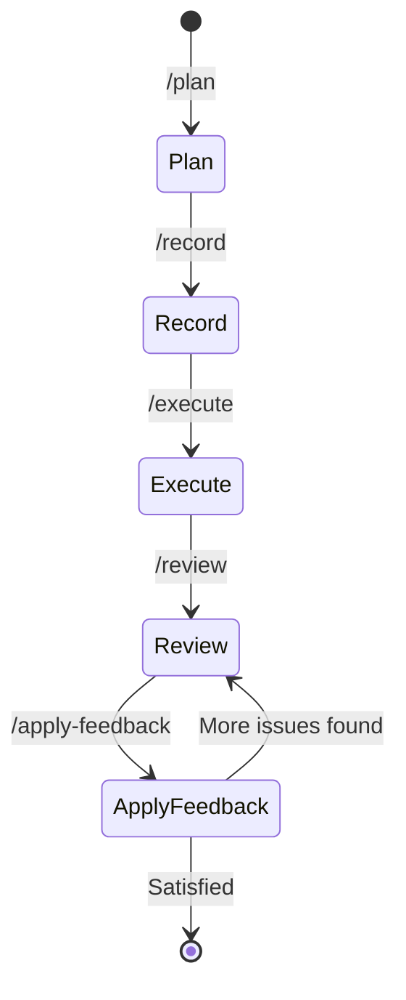

# Aircana

[](https://github.com/westonkd/aircana/actions/workflows/main.yml)
[](https://badge.fury.io/rb/aircana)

## Intro

Aircana is a CLI for creating **distributable Claude Code plugins** with per-agent knowledge bases. Generate team-shareable plugins where agents have access to curated documentation from Confluence and public websites.

**Key Features:**

**Plugin Generation**: Create Claude Code plugins with proper manifests, agents, commands, and hooks using ERB templates.

**Per-Agent Knowledge Bases**: Each agent gets dedicated documentation synced from Confluence (label-based) or web URLs, automatically converted to Markdown.

**Manifest-Based Tracking**: Knowledge sources are tracked in version-controlled manifest.json files. Team members independently refresh content using `aircana agents refresh`, keeping actual knowledge out of git (avoids bloat and sensitivity concerns).

**Team Distribution**: Share plugins via Git repositories or Claude Code plugin marketplaces. Team members can refresh knowledge bases from tracked sources without manual syncing.

**Complete Development Workflow**: Optional five-phase workflow (plan, record, execute, review, apply-feedback) with specialized agents for systematic feature development.

**Hook Management**: Event-driven automation through Claude Code hooks with support for multiple hook types.

Aircana's tools are built on "human-in-the-loop" principles, providing structure and knowledge management for AI-assisted development workflows.

## How can I try it?

### Installation

Install the gem:

```bash
gem install aircana
```

Verify installation and dependency setup:

```bash
aircana doctor
```

### Quick Start

Create a new Claude Code plugin:

```bash
# Create a new plugin directory
mkdir my-plugin
cd my-plugin

# Initialize the plugin
aircana init

# Or initialize with a custom name
aircana init --plugin-name my-custom-plugin
```

This creates a plugin structure with:
- `.claude-plugin/plugin.json` - Plugin manifest
- `agents/` - Specialized agents
- `commands/` - Slash commands
- `hooks/` - Hook configurations (hooks.json)
- `scripts/` - Hook scripts and utilities

### Next Steps

**1. Create a specialized agent:**
```bash
aircana agents create
```

**2. Add knowledge sources:**
```bash
# From Confluence (requires configuration)
aircana agents refresh my-agent

# From web URLs
aircana agents add-url my-agent https://docs.example.com
```

**3. Manage your plugin:**
```bash
# View plugin information
aircana plugin info

# Update plugin metadata
aircana plugin update

# Bump version
aircana plugin version bump patch

# Validate plugin structure
aircana plugin validate
```

**4. Install plugin in Claude Code:**
- Copy your plugin directory to a location Claude Code can access
- Use Claude Code's plugin installation commands to enable your plugin

### Things to try

- Configure the Confluence integration and create domain-specific agents

- Use the `/ask-expert` command to consult multiple specialized agents

- Set up the development workflow with plan, execute, review, and apply-feedback commands

- Explore other tools by running `aircana --help`

## Getting Started

This tutorial walks through creating a complete Claude Code plugin with agents backed by Confluence knowledge bases, then publishing it to a marketplace for team distribution.

### Prerequisites

1. **Install Aircana:**
```bash
gem install aircana
aircana doctor  # Verify dependencies
```

2. **Configure Confluence (optional but recommended):**

Add to your shell profile (`.bashrc`, `.zshrc`, etc.):
```bash
export CONFLUENCE_BASE_URL="https://your-company.atlassian.net"
export CONFLUENCE_USERNAME="your.email@company.com"
export CONFLUENCE_API_TOKEN="your-generated-token"
```

To generate a Confluence API token:
1. Go to your Confluence instance
2. Click profile picture → **Account Settings** → **Security**
3. Select **Create and manage API tokens** → **Create API token**
4. Copy the token and add to your environment variables

Reload your shell: `source ~/.zshrc` (or your shell config file)

### Step 1: Create Your Plugin

```bash
# Create a new directory for your plugin
mkdir my-team-plugin
cd my-team-plugin

# Initialize the plugin
aircana init --plugin-name my-team

# Verify the structure was created
ls -la
```

This creates:
- `.claude-plugin/plugin.json` - Plugin manifest with metadata
- `agents/` - Directory for specialized agents
- `commands/` - Custom slash commands
- `hooks/hooks.json` - Hook configurations
- `scripts/` - Hook scripts and utilities

### Step 2: Create an Agent Backed by Confluence

```bash
aircana agents create
```

You'll be prompted for:
- **Agent name**: e.g., "backend-api" (use kebab-case)
- **Description**: e.g., "Expert in backend API development and best practices"
- **Model**: Choose sonnet (smarter), haiku (faster), or inherit (uses default)
- **Color**: Pick an interface color for visual identification

The agent file is created at `agents/backend-api.md` with:
- Agent configuration (name, description, model)
- Knowledge base path reference
- Custom instructions

### Step 3: Tag Confluence Pages

In Confluence, label pages you want the agent to access:

1. Open a relevant Confluence page (e.g., "API Design Guidelines")
2. Click **...** → **Edit labels**
3. Add label: `backend-api` (must match your agent name)
4. Click **Save**

Repeat for all documentation pages relevant to this agent. Aircana will discover pages by label during the refresh process.

**Tip:** Use a consistent labeling strategy. For example, label all backend documentation with `backend-api`, all frontend docs with `frontend-expert`, etc.

### Step 4: Refresh Agent Knowledge

```bash
aircana agents refresh backend-api
```

This will:
1. Search Confluence for pages labeled `backend-api`
2. Download page content via Confluence REST API
3. Convert HTML to Markdown using ReverseMarkdown
4. Store content in the knowledge base directory
5. Update `agents/backend-api/manifest.json` with source metadata

**Output:** Knowledge files are created in `~/.claude/agents/my-team-backend-api/knowledge/`

**Note:** The actual knowledge content is stored globally (not in your plugin directory) to avoid version control bloat and potential sensitive information leaks. Only the manifest (source tracking) is version controlled.

### Step 5: Add Web URLs (Optional)

You can also add public web documentation to your agent's knowledge base:

```bash
aircana agents add-url backend-api https://docs.example.com/api-guide
aircana agents add-url backend-api https://restfulapi.net/rest-architectural-constraints/
```

This downloads the web page, extracts main content (removes nav/ads/scripts), converts to Markdown, and adds it to the knowledge base.

Refresh to sync web URLs:
```bash
aircana agents refresh backend-api
```

### Step 6: Use Your Agent

Your agent is now ready! Claude Code will automatically consult your agent when appropriate based on the agent's description. You can also explicitly request the agent:

```
Ask backend-api to review this API endpoint design
Ask backend-api how to implement authentication
```

The agent has access to all Confluence pages and web URLs you've synced to its knowledge base.

### Step 7: Share Your Plugin with Your Team

**Option A: Git Repository Distribution**

1. **Initialize Git repository:**
```bash
git init
git add .
git commit -m "Initial plugin setup with backend-api agent"
```

2. **Push to GitHub:**
```bash
gh repo create my-company/my-team-plugin --private --source=. --push
```

3. **Team members install:**
```bash
# Team members clone the plugin
git clone https://github.com/my-company/my-team-plugin.git ~/.claude-plugins/my-team

# Configure Confluence credentials (each team member)
export CONFLUENCE_BASE_URL="..."
export CONFLUENCE_USERNAME="..."
export CONFLUENCE_API_TOKEN="..."

# Refresh knowledge bases (syncs from tracked sources)
cd ~/.claude-plugins/my-team
aircana agents refresh-all
```

**Option B: Add to a Plugin Marketplace**

Create or update a marketplace repository with your plugin:

1. **Create a marketplace.json file** (in a separate marketplace repo):
```json
{
  "name": "My Company Plugin Marketplace",
  "description": "Internal Claude Code plugins for my-company",
  "plugins": [
    {
      "name": "my-team",
      "description": "Backend API development agents and workflows",
      "source": {
        "source": "github",
        "repo": "my-company/my-team-plugin"
      },
      "version": "1.0.0",
      "author": "My Company Engineering",
      "category": "development"
    }
  ]
}
```

2. **Push marketplace configuration:**
```bash
# In your marketplace repository
git add .claude-plugin/marketplace.json
git commit -m "Add my-team plugin"
git push
```

3. **Team members install from marketplace:**

Team members add the marketplace URL to their Claude Code configuration, then install plugins directly from the marketplace UI.

See [Claude Code Plugin Marketplaces](https://docs.claude.com/en/docs/claude-code/plugin-marketplaces) for complete marketplace setup instructions.

### Next: Keep Knowledge Up-to-Date

As your Confluence documentation evolves:

```bash
# Refresh a specific agent's knowledge
aircana agents refresh backend-api

# Or refresh all agents at once
aircana agents refresh-all
```

Knowledge sources are tracked in `agents/<agent-name>/manifest.json`, so team members can independently refresh without manual coordination.

## Key Concepts

### Plugins

Aircana creates Claude Code plugins - portable, distributable packages that extend Claude Code with custom functionality. Each plugin includes:
- **Manifest**: Metadata describing the plugin (name, version, author, etc.)
- **Agents**: Specialized domain experts
- **Commands**: Custom slash commands
- **Hooks**: Event-driven automation

Plugins can be shared with teams or published to plugin marketplaces for broader distribution.

#### Plugin Manifest Structure

The `.claude-plugin/plugin.json` file defines plugin metadata:

```json
{
  "name": "my-plugin",
  "version": "1.0.0",
  "description": "Brief plugin description",
  "author": {
    "name": "Author Name",
    "email": "[email protected]",
    "url": "https://github.com/author"
  },
  "homepage": "https://docs.example.com/plugin",
  "repository": "https://github.com/author/plugin",
  "license": "MIT",
  "keywords": ["keyword1", "keyword2"]
}
```

Optional path overrides (for non-standard layouts):
```json
{
  "commands": "./custom/commands/",
  "agents": "./custom/agents/",
  "hooks": "./config/hooks.json",
  "mcpServers": "./mcp-config.json"
}
```

### Specialized Agents

Agents are domain-specific experts to whom Claude Code can delegate tasks and questions. Each agent has:
- **Dedicated context window**: Prevents context pollution and maintains focus
- **Knowledge base**: Access to curated domain-specific documentation
- **Custom configuration**: Model, color, and behavior settings

Claude Code can run agents in parallel, creating a "swarm" of experts that can expedite planning and execution while considering broader context.

### Knowledge Bases

Aircana provides each agent with a human-curated knowledge base stored within the plugin structure. This enables agents to:
- Access domain-specific documentation automatically
- Stay up-to-date with refreshable sources
- Provide more relevant responses with less back-and-forth

Knowledge bases support multiple source types and can be refreshed to pull the latest content.

#### Confluence

To add a Confluence page to an agent's knowledge base, label the desired page in Confluence, then run `aircana agent refresh <AGENT>`.

Aircana will also pull any Confluence pages labeled with a matching agent name during initial agent creation (`aircana agent create`).

See the Confluence setup guide or run `aircana doctor` for instructions on setting up Confluence integration.

#### Websites

In addition to Confluence sources, Aircana allows adding arbitrary public websites to a knowledge base.

Websites are also refreshed when `aircana agent refresh <AGENT>` is used.

#### Structure

Knowledge bases are stored within the plugin's agent directory. For example:

```
my-plugin/
├── .claude-plugin/
│   └── plugin.json
├── agents/
│   ├── backend-expert.md
│   └── backend-expert/
│       ├── knowledge/
│       │   ├── API-Design.md
│       │   └── Authentication.md
│       └── manifest.json
├── commands/
│   └── ask-expert.md
├── hooks/
│   └── hooks.json
└── scripts/
    ├── pre_tool_use.sh
    └── session_start.sh
```

Agent files and their knowledge bases are co-located in the plugin's `agents/` directory.

**Version Control Considerations:**

In many cases, adding the actual knowledge base to version control is undesirable because:
- Knowledge bases may contain numerous files, bloating repository size
- Content may include sensitive information not suitable for public repos
- Knowledge refreshes would create frequent, large commits

Aircana manages a per-agent `manifest.json` file to track knowledge sources without committing the actual content. Team members can refresh knowledge bases using `aircana agents refresh`.

### Plugin Artifacts

Aircana uses ERB templates to generate plugin components consistently:
- **Agents**: Domain experts with knowledge base integration
- **Commands**: Slash commands with parameter handling
- **Hooks**: Event handlers for automation

These templates promote best practices and help create effective plugin components without extensive trial and error.

### SQS Integration (Slack Integration at Instructure)

Aircana uses the "Notification" Claude Code hook to send messages to SQS.

At Instructure this means you can easily configure Claude Code to send you slack messages when it needs your attention via Aircana

(Instructions coming soon, send a message if you want help with this)

## Development Workflow

Aircana provides a complete development lifecycle through five integrated slash commands:



### Quick Overview

1. **`/plan`** - Create strategic implementation plan
2. **`/record`** - Save plan to Jira ticket
3. **`/execute`** - Implement plan and create commit
4. **`/review`** - Adversarial code review with expert feedback
5. **`/apply-feedback`** - Apply review changes and amend commit

### Command Details

#### 1. `/plan` - Strategic Planning

Creates a high-level implementation plan by:
- Asking you to specify relevant files and directories
- Consulting specialized sub-agents for domain expertise
- Sharing research context to avoid duplicate work
- Generating a focused strategic plan (what to do, not how)
- Creating actionable todo checklist

The planner focuses on architecture decisions and approach, avoiding exhaustive code implementations.

#### 2. `/record` - Save to Jira

Records your approved plan to a Jira ticket by:
- Taking the ticket key/ID as input
- Delegating to the `jira` sub-agent for MCP operations
- Storing the plan in the ticket description or comments

This creates a traceable link between planning and execution.

#### 3. `/execute` - Implementation

Executes the strategic plan by:
- Reading the plan from the Jira ticket
- Creating detailed implementation todo list
- Presenting plan for your approval
- Implementing changes sequentially
- Writing unit tests (delegates to test-writing sub-agent if available)
- Running tests to verify implementation
- Creating git commit (delegates to git-ops sub-agent if available)

After commit creation, suggests running `/review`.

#### 4. `/review` - Adversarial Review

Conducts comprehensive code review of HEAD commit by:
- Analyzing changed files to identify technical domains
- Using sub-agent-coordinator to select relevant expert agents
- Presenting changes to experts in parallel
- Synthesizing feedback organized by severity (Critical/Important/Suggestions)
- Storing review output for next step

Explicitly states "Reviewing: <commit message>" and ends with "Run /apply-feedback".

#### 5. `/apply-feedback` - Apply Changes

Applies code review feedback by:
- Reading review output from conversation context
- Creating prioritized change plan (critical issues first)
- Presenting plan for your approval
- Applying approved changes
- Re-running unit tests
- Fixing any test failures
- **Amending HEAD commit** with improvements using `git commit --amend --no-edit`

This preserves the original commit message while incorporating review improvements in a single commit.

### Usage Example

```bash
# 1. Start planning
/plan
> Specify relevant files: src/api/, spec/api/

# 2. Save plan to ticket
/record PROJ-123

# 3. Execute implementation
/execute PROJ-123

# 4. Review the commit
/review

# 5. Apply feedback
/apply-feedback
```

## Configuration (Optional)

### Confluence Setup (Optional)

To use agent knowledge sync features, you'll need to configure Confluence integration:

#### 1. Generate Confluence API Token

1. Go to your Confluence instance
2. Click your profile picture → **Account Settings**
3. Select **Security** → **Create and manage API tokens**
4. Click **Create API token**
5. Give it a descriptive name (e.g., "Aircana Integration")
6. Copy the generated token

#### 2. Set Environment Variables

Add these to your shell profile (`.bashrc`, `.zshrc`, etc.):

```bash
export CONFLUENCE_BASE_URL="https://your-company.atlassian.net"
export CONFLUENCE_USERNAME="your.email@company.com"
export CONFLUENCE_API_TOKEN="your-generated-token"
```

### SQS Notifications Setup (Optional)

To enable SQS notifications for Claude Code events (useful for Slack/Teams integration):

#### 1. Install AWS CLI

Make sure you have the AWS CLI installed:

```bash
# macOS
brew install awscli

# Ubuntu/Debian
apt install awscli

# Configure AWS credentials
aws configure
```

#### 2. Set Environment Variables

Add these to your shell profile (`.bashrc`, `.zshrc`, etc.):

```bash
export AIRCANA_SQS_QUEUE_URL="https://sqs.us-east-1.amazonaws.com/your-account/your-queue"
export AIRCANA_SQS_MESSAGE_TEMPLATE='{"channel":"changelog","username":"Aircana","text":"{{message}}"}'
export AWS_REGION="us-east-1"
```

The message template supports `{{message}}` placeholder which gets replaced with the Claude Code notification text.

#### 3. Install and Enable Hook

```bash
aircana generate
aircana init
aircana hooks enable notification_sqs
```

Reload your shell or run `source ~/.zshrc` (or your shell config file).

### Verify Configuration

```bash
aircana doctor
```

This will check if Confluence and other integrations are properly configured.

## All Commands

### Plugin Management
```bash
aircana init [DIRECTORY]           # Initialize a new plugin (defaults to current directory)
aircana init --plugin-name NAME    # Initialize with custom plugin name
aircana plugin info                # Display plugin information
aircana plugin update              # Update plugin metadata
aircana plugin version             # Show current version
aircana plugin version bump [TYPE] # Bump version (major, minor, or patch)
aircana plugin version set         # Set specific version
aircana plugin validate            # Validate plugin structure
```

### Agent Management
```bash
aircana agents create              # Create new agent interactively
aircana agents refresh [AGENT]     # Sync agent knowledge from Confluence and web sources
aircana agents refresh-all         # Refresh knowledge for all agents
aircana agents add-url [AGENT] [URL] # Add a web URL to an agent's knowledge base
aircana agents list                # List all configured agents
```

### Hook Management
```bash
aircana hooks list                 # List all available and installed hooks
aircana hooks enable [HOOK]        # Enable a specific hook
aircana hooks disable [HOOK]       # Disable a specific hook
aircana hooks create               # Create custom hook
aircana hooks status               # Show hook configuration status
```

### System
```bash
aircana generate                   # Generate plugin components from templates
aircana doctor                     # Check system health and dependencies
aircana doctor --verbose           # Show detailed dependency information
aircana dump-context [AGENT]       # View current context for agent
```

## Development

After checking out the repo, run `bin/setup` to install dependencies. Then, run `rake spec` to run the tests. You can also run `bin/console` for an interactive prompt that will allow you to experiment.

Run commands in development with `bundle exec exe/aircana <command>`

To install this gem onto your local machine, run `bundle exec rake install`. To release a new version, update the version number in `version.rb`, and then run `bundle exec rake release`, which will create a git tag for the version, push git commits and the created tag, and push the `.gem` file to [rubygems.org](https://rubygems.org).

## Contributing

Bug reports and pull requests are welcome on GitHub at https://github.com/westonkd/aircana.

## License

The gem is available as open source under the terms of the [MIT License](https://opensource.org/licenses/MIT).
