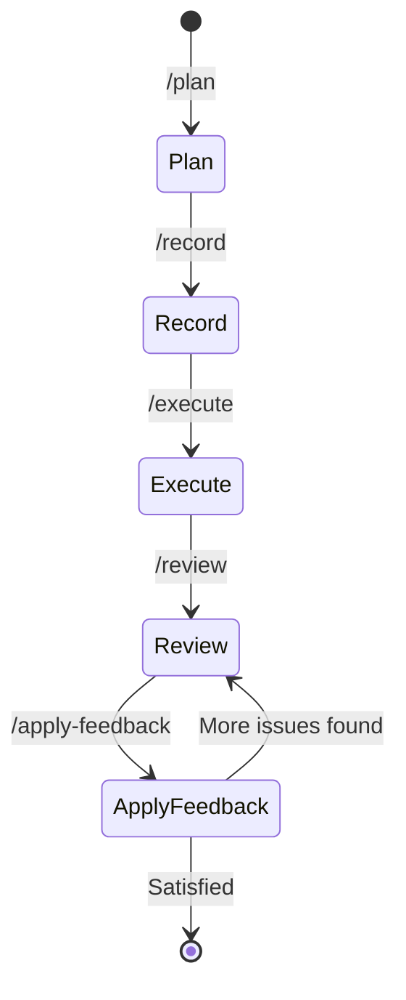

# Aircana

[](https://github.com/westonkd/aircana/actions/workflows/main.yml)
[](https://badge.fury.io/rb/aircana)

## Intro

Aircana is a "batteries-included" CLI for creating and managing Claude Code plugins. It provides:

**Plugin Development**: Create distributable Claude Code plugins with proper manifests and structure.

**Knowledge Base Management**: Agent-accessible knowledge bases sourced from Confluence or public websites, with automatic syncing and caching.

**Specialized Agents**: Generate domain-specific agents with dedicated knowledge bases for improved context management.

**Complete Development Workflow**: Five-phase workflow (plan, record, execute, review, apply-feedback) for systematic feature development.

**Hook Management**: Event-driven automation through Claude Code hooks with support for multiple hook types.

**Plugin Distribution**: Create plugins that can be shared via Claude Code plugin marketplaces.

While Aircana includes features beneficial in many agentic contexts (like knowledge base syncing), its primary tools are built on "human-in-the-loop" principles.

## How can I try it?

### Installation

Install the gem:

```bash
gem install aircana
```

Verify installation and dependency setup:

```bash
aircana doctor
```

### Quick Start

Create a new Claude Code plugin:

```bash
# Create a new plugin directory
mkdir my-plugin
cd my-plugin

# Initialize the plugin
aircana init

# Or initialize with a custom name
aircana init --plugin-name my-custom-plugin
```

This creates a plugin structure with:
- `.claude-plugin/plugin.json` - Plugin manifest
- `agents/` - Specialized agents
- `commands/` - Slash commands
- `hooks/` - Hook configurations (hooks.json)
- `scripts/` - Hook scripts and utilities

### Next Steps

**1. Create a specialized agent:**
```bash
aircana agents create
```

**2. Add knowledge sources:**
```bash
# From Confluence (requires configuration)
aircana agents refresh my-agent

# From web URLs
aircana agents add-url my-agent https://docs.example.com
```

**3. Manage your plugin:**
```bash
# View plugin information
aircana plugin info

# Update plugin metadata
aircana plugin update

# Bump version
aircana plugin version bump patch

# Validate plugin structure
aircana plugin validate
```

**4. Install plugin in Claude Code:**
- Copy your plugin directory to a location Claude Code can access
- Use Claude Code's plugin installation commands to enable your plugin

### Things to try

- Configure the Confluence integration and create domain-specific agents

- Use the `/ask-expert` command to consult multiple specialized agents

- Set up the development workflow with plan, execute, review, and apply-feedback commands

- Explore other tools by running `aircana --help`

## Development Workflow

Aircana provides a complete development lifecycle through five integrated slash commands:



### Quick Overview

1. **`/plan`** - Create strategic implementation plan
2. **`/record`** - Save plan to Jira ticket
3. **`/execute`** - Implement plan and create commit
4. **`/review`** - Adversarial code review with expert feedback
5. **`/apply-feedback`** - Apply review changes and amend commit

### Command Details

#### 1. `/plan` - Strategic Planning

Creates a high-level implementation plan by:
- Asking you to specify relevant files and directories
- Consulting specialized sub-agents for domain expertise
- Sharing research context to avoid duplicate work
- Generating a focused strategic plan (what to do, not how)
- Creating actionable todo checklist

The planner focuses on architecture decisions and approach, avoiding exhaustive code implementations.

#### 2. `/record` - Save to Jira

Records your approved plan to a Jira ticket by:
- Taking the ticket key/ID as input
- Delegating to the `jira` sub-agent for MCP operations
- Storing the plan in the ticket description or comments

This creates a traceable link between planning and execution.

#### 3. `/execute` - Implementation

Executes the strategic plan by:
- Reading the plan from the Jira ticket
- Creating detailed implementation todo list
- Presenting plan for your approval
- Implementing changes sequentially
- Writing unit tests (delegates to test-writing sub-agent if available)
- Running tests to verify implementation
- Creating git commit (delegates to git-ops sub-agent if available)

After commit creation, suggests running `/review`.

#### 4. `/review` - Adversarial Review

Conducts comprehensive code review of HEAD commit by:
- Analyzing changed files to identify technical domains
- Using sub-agent-coordinator to select relevant expert agents
- Presenting changes to experts in parallel
- Synthesizing feedback organized by severity (Critical/Important/Suggestions)
- Storing review output for next step

Explicitly states "Reviewing: <commit message>" and ends with "Run /apply-feedback".

#### 5. `/apply-feedback` - Apply Changes

Applies code review feedback by:
- Reading review output from conversation context
- Creating prioritized change plan (critical issues first)
- Presenting plan for your approval
- Applying approved changes
- Re-running unit tests
- Fixing any test failures
- **Amending HEAD commit** with improvements using `git commit --amend --no-edit`

This preserves the original commit message while incorporating review improvements in a single commit.

### Usage Example

```bash
# 1. Start planning
/plan
> Specify relevant files: src/api/, spec/api/

# 2. Save plan to ticket
/record PROJ-123

# 3. Execute implementation
/execute PROJ-123

# 4. Review the commit
/review

# 5. Apply feedback
/apply-feedback
```

## Key Concepts

### Plugins

Aircana creates Claude Code plugins - portable, distributable packages that extend Claude Code with custom functionality. Each plugin includes:
- **Manifest**: Metadata describing the plugin (name, version, author, etc.)
- **Agents**: Specialized domain experts
- **Commands**: Custom slash commands
- **Hooks**: Event-driven automation

Plugins can be shared with teams or published to plugin marketplaces for broader distribution.

#### Plugin Manifest Structure

The `.claude-plugin/plugin.json` file defines plugin metadata:

```json
{
  "name": "my-plugin",
  "version": "1.0.0",
  "description": "Brief plugin description",
  "author": {
    "name": "Author Name",
    "email": "[email protected]",
    "url": "https://github.com/author"
  },
  "homepage": "https://docs.example.com/plugin",
  "repository": "https://github.com/author/plugin",
  "license": "MIT",
  "keywords": ["keyword1", "keyword2"]
}
```

Optional path overrides (for non-standard layouts):
```json
{
  "commands": "./custom/commands/",
  "agents": "./custom/agents/",
  "hooks": "./config/hooks.json",
  "mcpServers": "./mcp-config.json"
}
```

### Specialized Agents

Agents are domain-specific experts to whom Claude Code can delegate tasks and questions. Each agent has:
- **Dedicated context window**: Prevents context pollution and maintains focus
- **Knowledge base**: Access to curated domain-specific documentation
- **Custom configuration**: Model, color, and behavior settings

Claude Code can run agents in parallel, creating a "swarm" of experts that can expedite planning and execution while considering broader context.

### Knowledge Bases

Aircana provides each agent with a human-curated knowledge base stored within the plugin structure. This enables agents to:
- Access domain-specific documentation automatically
- Stay up-to-date with refreshable sources
- Provide more relevant responses with less back-and-forth

Knowledge bases support multiple source types and can be refreshed to pull the latest content.

#### Confluence

To add a Confluence page to an agent's knowledge base, label the desired page in Confluence, then run `aircana agent refresh <AGENT>`.

Aircana will also pull any Confluence pages labeled with a matching agent name during initial agent creation (`aircana agent create`).

See the Confluence setup guide or run `aircana doctor` for instructions on setting up Confluence integration.

#### Websites

In addition to Confluence sources, Aircana allows adding arbitrary public websites to a knowledge base.

Websites are also refreshed when `aircana agent refresh <AGENT>` is used.

#### Structure

Knowledge bases are stored within the plugin's agent directory. For example:

```
my-plugin/
├── .claude-plugin/
│   └── plugin.json
├── agents/
│   ├── backend-expert.md
│   └── backend-expert/
│       ├── knowledge/
│       │   ├── API-Design.md
│       │   └── Authentication.md
│       └── manifest.json
├── commands/
│   └── ask-expert.md
├── hooks/
│   └── hooks.json
└── scripts/
    ├── pre_tool_use.sh
    └── session_start.sh
```

Agent files and their knowledge bases are co-located in the plugin's `agents/` directory.

**Version Control Considerations:**

In many cases, adding the actual knowledge base to version control is undesirable because:
- Knowledge bases may contain numerous files, bloating repository size
- Content may include sensitive information not suitable for public repos
- Knowledge refreshes would create frequent, large commits

Aircana manages a per-agent `manifest.json` file to track knowledge sources without committing the actual content. Team members can refresh knowledge bases using `aircana agents refresh`.

### Plugin Artifacts

Aircana uses ERB templates to generate plugin components consistently:
- **Agents**: Domain experts with knowledge base integration
- **Commands**: Slash commands with parameter handling
- **Hooks**: Event handlers for automation

These templates promote best practices and help create effective plugin components without extensive trial and error.

### SQS Integration (Slack Integration at Instructure)

Aircana uses the "Notification" Claude Code hook to send messages to SQS.

At Instructure this means you can easily configure Claude Code to send you slack messages when it needs your attention via Aircana

(Instructions coming soon, send a message if you want help with this)

## Configuration (Optional)

### Confluence Setup (Optional)

To use agent knowledge sync features, you'll need to configure Confluence integration:

#### 1. Generate Confluence API Token

1. Go to your Confluence instance
2. Click your profile picture → **Account Settings**
3. Select **Security** → **Create and manage API tokens**
4. Click **Create API token**
5. Give it a descriptive name (e.g., "Aircana Integration")
6. Copy the generated token

#### 2. Set Environment Variables

Add these to your shell profile (`.bashrc`, `.zshrc`, etc.):

```bash
export CONFLUENCE_BASE_URL="https://your-company.atlassian.net"
export CONFLUENCE_USERNAME="your.email@company.com"
export CONFLUENCE_API_TOKEN="your-generated-token"
```

### SQS Notifications Setup (Optional)

To enable SQS notifications for Claude Code events (useful for Slack/Teams integration):

#### 1. Install AWS CLI

Make sure you have the AWS CLI installed:

```bash
# macOS
brew install awscli

# Ubuntu/Debian
apt install awscli

# Configure AWS credentials
aws configure
```

#### 2. Set Environment Variables

Add these to your shell profile (`.bashrc`, `.zshrc`, etc.):

```bash
export AIRCANA_SQS_QUEUE_URL="https://sqs.us-east-1.amazonaws.com/your-account/your-queue"
export AIRCANA_SQS_MESSAGE_TEMPLATE='{"channel":"changelog","username":"Aircana","text":"{{message}}"}'
export AWS_REGION="us-east-1"
```

The message template supports `{{message}}` placeholder which gets replaced with the Claude Code notification text.

#### 3. Install and Enable Hook

```bash
aircana generate
aircana init
aircana hooks enable notification_sqs
```

Reload your shell or run `source ~/.zshrc` (or your shell config file).

### Verify Configuration

```bash
aircana doctor
```

This will check if Confluence and other integrations are properly configured.

## Agent Workflow Tutorial

Here's a complete example of creating an agent and syncing knowledge from Confluence:

### 1. Create an Agent

```bash
aircana agents create
```

You'll be prompted for:
- **Agent name**: e.g., "backend-api"
- **Description**: e.g., "Helps with backend API development"
- **Model**: Choose from sonnet, haiku, or inherit
- **Color**: Choose interface color

### 2. Tag Confluence Pages

In Confluence, add the label `backend-api` (matching your agent name) to relevant pages:

1. Open a Confluence page with relevant documentation
2. Click **...** → **Edit labels**
3. Add label: `backend-api`
4. Save

Repeat for all pages you want the agent to know about.

### 3. Add Knowledge Sources

**From Confluence:**
```bash
aircana agents refresh backend-api
```

This downloads all Confluence pages labeled `backend-api` and makes them available to your agent.

**From Web URLs:**
```bash
aircana agents add-url backend-api https://docs.example.com/api-guide
aircana agents add-url backend-api https://blog.example.com/best-practices
```

This fetches web content and converts it to Markdown for your agent's knowledge base.

### 4. Use the Agent

Once created with a good description, Claude Code will automatically use your agent when appropriate during conversations. You can also explicitly request a specific agent:

```
Ask backend-api for a code review of this function
Ask backend-api to help debug this API endpoint
Ask rspec-test-writer to write and run tests for @file
```

The agent will have access to all the Confluence knowledge you synced.

### 5. Update Knowledge

Whenever you update Confluence pages, add new ones with the agent label, or want to refresh web content:

```bash
aircana agents refresh backend-api
```

This refreshes both Confluence pages and web URLs associated with the agent.


## All Commands

### Plugin Management
```bash
aircana init [DIRECTORY]           # Initialize a new plugin (defaults to current directory)
aircana init --plugin-name NAME    # Initialize with custom plugin name
aircana plugin info                # Display plugin information
aircana plugin update              # Update plugin metadata
aircana plugin version             # Show current version
aircana plugin version bump [TYPE] # Bump version (major, minor, or patch)
aircana plugin version set         # Set specific version
aircana plugin validate            # Validate plugin structure
```

### Agent Management
```bash
aircana agents create              # Create new agent interactively
aircana agents refresh [AGENT]     # Sync agent knowledge from Confluence and web sources
aircana agents refresh-all         # Refresh knowledge for all agents
aircana agents add-url [AGENT] [URL] # Add a web URL to an agent's knowledge base
aircana agents list                # List all configured agents
```

### Hook Management
```bash
aircana hooks list                 # List all available and installed hooks
aircana hooks enable [HOOK]        # Enable a specific hook
aircana hooks disable [HOOK]       # Disable a specific hook
aircana hooks create               # Create custom hook
aircana hooks status               # Show hook configuration status
```

### System
```bash
aircana generate                   # Generate plugin components from templates
aircana doctor                     # Check system health and dependencies
aircana doctor --verbose           # Show detailed dependency information
aircana dump-context [AGENT]       # View current context for agent
```

## Development

After checking out the repo, run `bin/setup` to install dependencies. Then, run `rake spec` to run the tests. You can also run `bin/console` for an interactive prompt that will allow you to experiment.

Run commands in development with `bundle exec exe/aircana <command>`

To install this gem onto your local machine, run `bundle exec rake install`. To release a new version, update the version number in `version.rb`, and then run `bundle exec rake release`, which will create a git tag for the version, push git commits and the created tag, and push the `.gem` file to [rubygems.org](https://rubygems.org).

## Contributing

Bug reports and pull requests are welcome on GitHub at https://github.com/westonkd/aircana.

## License

The gem is available as open source under the terms of the [MIT License](https://opensource.org/licenses/MIT).
